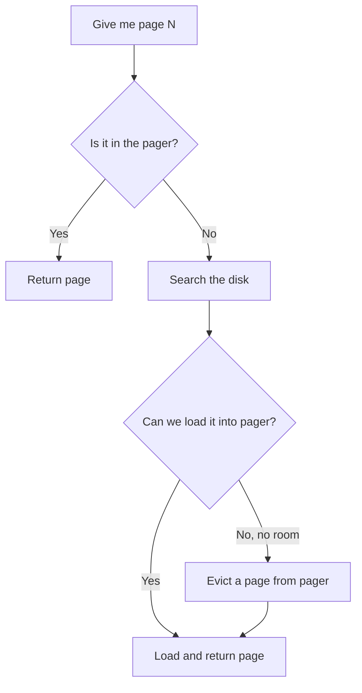
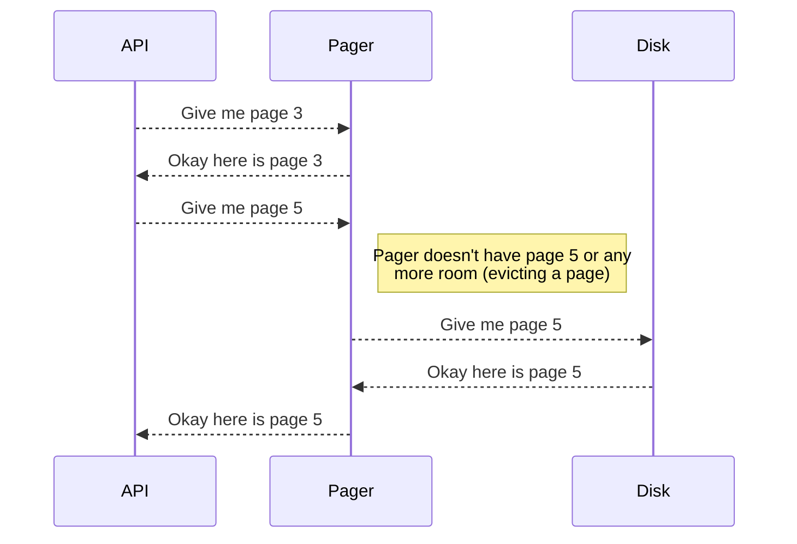

## Reading a page from the pager

```mermaid
graph
    A[Give me page N] --> B{Is it in the pager?}
    B -- Yes --> C[Return page]
    B -- No --> D[Search the disk]
    D --> E{Can we load it into pager?}    
    E -- Yes --> F[Load and return page]
    E -- No, no room --> G[Evict a page from pager]
    G --> F
```

```mermaid
sequenceDiagram
    participant API
    participant Pager
    participant Disk
    API-->>Pager: Give me page 3
    Pager-->>API: Okay here is page 3
    #loop PagingProcess
    #    Pager<<-->>Disk: 
    #end
    API-->>Pager: Give me page 5
    Note right of Pager: Pager doesn't have page 5 or any<br>more room (evicting a page)
    Pager-->>Disk: Give me page 5 
    Disk-->>Pager: Okay here is page 5
    Pager-->>API: Okay here is page 5
```